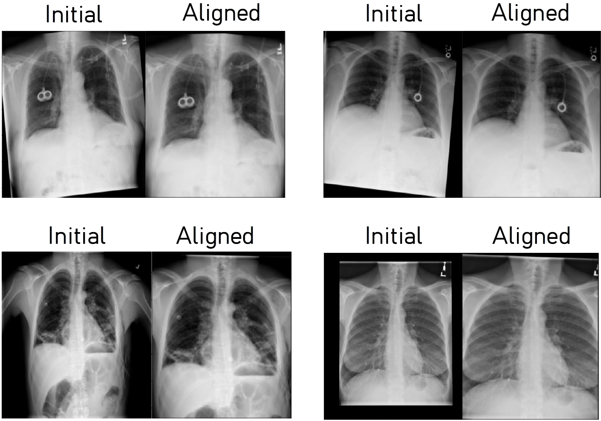
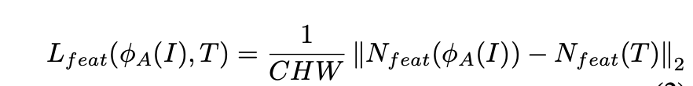

# Chest X-ray alignment using Spatial Transformer Network

This is the `Python` implementation of the final project on Skoltech university MSc Data Science ML 2023 course "Spatial Transformer Network for Chest X-ray images preprocessing".

Team:

Andrey Galichin\
Evgeny Gurov\
Arkadiy Vladimirov

The repository contains reproducible `PyTorch` and `Pytorch Lightning` code for training and inference of our model which produces **properly aligned Chest X-ray images**. For convenience of performing different experiments effectively, we utilize `hydra` configs. We also provide some examples of our model performance, using Chest X-ray images from [Chest X-ray14](https://arxiv.org/pdf/1705.02315v5.pdf) dataset.

## Prerequisites

The training of our alignment model is GPU-based, inference can be done both on CPU or GPU. The only requirement for the gpu type is to be compatible with **CUDA 11.2**.

We highly recommend to use `conda` to build an appropriate environment. Working version could be created using `environment.yml` configuration file as follows:
```
conda env create -f environment.yml
```

## Repository structure

Evaluation of the model is issued in the form of pretty self-explanatory single jupyter notebook `Alignment (Evaluation).ipynb`. For convenience, some of the results will be presented further. Auxilary source code is moved to `.py` modules (`src/`), `hydra` configs are located in `configs/` to preserve the structure recommended by authors.

### Training

Minimal required steps to run the training pipeline:

* download [Chest X-ray14](https://nihcc.app.box.com/v/ChestXray-NIHCC/folder/36938765345) dataset (download full `images/` directory and unzip all the data in it)
* in `configs/data/nih.yaml`, change the **main_dir** parameter to the directory path where the dataset downloaded from the previous step is located
* run `python run_training.py` in the following directory

### In-depth description

In this section we present a deeper explanation of the code structure:

* `configs/` -- `hydra` configuration files, one for each step of training pipeline (e.g. dataset, model, optimizer, scheduler, etc.). Refer to [hydra documentation](https://hydra.cc/docs/intro/) for better understanding of overall structure
* `src/data/` -- directory with dataset-based classes. This includes dataset class (`dataset.py`), augmentations (`transforms.py`) and other utility functions (`dataset_utils.py`). To have a rich set of augmentations, we use [albumentations](https://albumentations.ai/)
* `src/losses.py` -- loss functions used for training the alignment model
* `src/modules.py` -- contains implementation of our neural network. To obtain pretrained SotA neural networks we use [timm](https://github.com/huggingface/pytorch-image-models) repository
* `src/models.py` -- `pytorch-lightning` wrapper around our model
* `src/train.py` -- main function that collects all the configurations, initializes all modules and runs training

## Results

### Visualizations

Here we present some examples of our **Alignment network** on *Chest X-ray14* dataset (**Initial** is an input chest, **Aligned** is the aligned version outputted by our model):

<p align="center"></p>

### Classification

In addition to the visualizations, we also evaluated our model performance on downstream [classification task](https://paperswithcode.com/sota/multi-label-classification-on-chestx-ray14). Specifically, we constructed a standard training pipeline following [CheXNet](https://arxiv.org/pdf/1711.05225v3.pdf) paper and performed 2 experiments on different datasets: standard *Chest X-ray14* and it's aligned version, created using our alignment model.

The results on all 14 classes are shown in the following tables, metric is **AUROC** (Area Under Receiver Operating Curve):

<p align="center"></p>

From the results we can see that our alignment module does improve the classification model results on 8 out of 14 diseases.

**Note:** This project is closely related with the work *Andrey Galichin* does as part of his job at the company, which also includes all the classification training pipeline. Hence, due to some obvious restrictions, we can't share it to the public.
